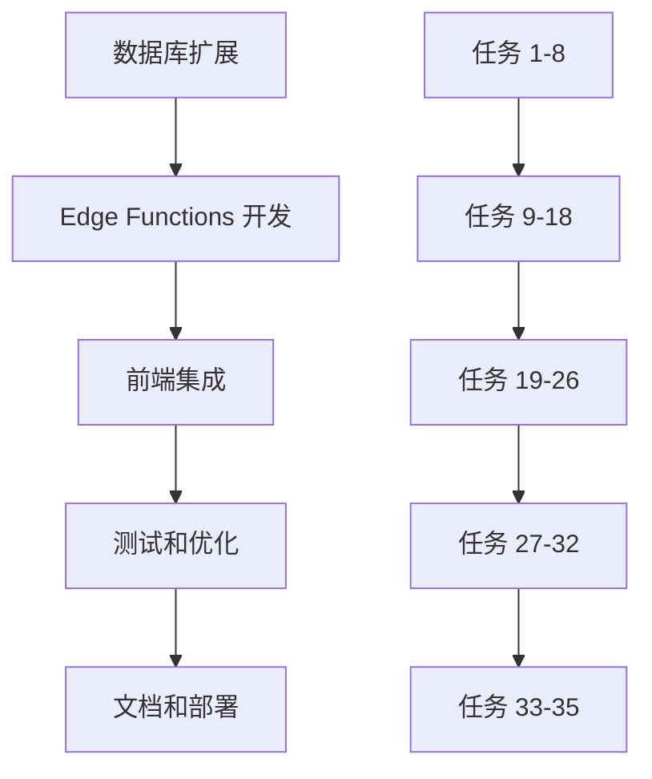

# 任务清单

**变更ID**: `enhance-ai-edge-analytics-admin`
**总任务数**: 35
**创建日期**: 2025-11-02

## 阶段一：数据库扩展（任务 1-8）

### 数据库设计和创建

#### [ ] 任务 1: 创建 story_reads 表
- **内容**: 设计并创建 `story_reads` 表，记录阅读事件
- **验收标准**:
  - SQL 脚本运行成功
  - 表结构符合规范（id, story_id, user_identifier, read_at, user_agent, referrer）
  - 所有字段类型和约束正确
- **预计时间**: 30 分钟

#### [ ] 任务 2: 创建数据库索引
- **内容**: 为 `story_reads` 表创建优化索引
- **验收标准**:
  - 创建 `idx_story_reads_story_id_read_at` 复合索引
  - 创建 `idx_story_reads_user_identifier` 索引
  - 创建 `idx_story_reads_read_at` 索引
  - 使用 EXPLAIN 验证索引使用情况
- **预计时间**: 20 分钟

#### [ ] 任务 3: 配置行级安全策略（RLS）
- **内容**: 为 `story_reads` 表启用 RLS 并创建策略
- **验收标准**:
  - 执行 `ALTER TABLE story_reads ENABLE ROW LEVEL SECURITY`
  - 创建允许公共插入的策略
  - 验证策略有效性
- **预计时间**: 15 分钟

#### [ ] 任务 4: 创建数据库触发器
- **内容**: 设置自动更新触发器（如果需要）
- **验收标准**:
  - 可选任务，仅在需要自动清理时实施
  - 文档化触发器逻辑
- **预计时间**: 30 分钟（可选）

#### [ ] 任务 5: 验证数据库结构
- **内容**: 检查数据库表和索引是否正确创建
- **验收标准**:
  - 使用 Supabase Dashboard 验证表结构
  - 确认索引存在并生效
  - 测试 RLS 策略
- **预计时间**: 15 分钟

#### [ ] 任务 6: 编写数据库测试脚本
- **内容**: 创建 SQL 测试脚本验证表功能
- **验收标准**:
  - 测试插入记录
  - 测试索引查询性能
  - 测试 RLS 策略
- **预计时间**: 30 分钟

#### [ ] 任务 7: 文档化数据库设计
- **内容**: 编写数据库设计文档
- **验收标准**:
  - 包含表结构说明
  - 索引策略说明
  - RLS 策略说明
  - 使用示例
- **预计时间**: 30 分钟

#### [ ] 任务 8: 备份当前数据库状态
- **内容**: 在修改前备份现有数据
- **验收标准**:
  - 导出当前 stories 表数据
  - 记录数据库版本
  - 可恢复方案测试
- **预计时间**: 15 分钟

## 阶段二：Edge Functions 开发（任务 9-18）

### AI 故事生成 Edge Function

#### [ ] 任务 9: 初始化 Supabase Edge Functions 项目
- **内容**: 设置 Edge Functions 开发环境
- **验收标准**:
  - 执行 `supabase init`
  - 创建目录结构
  - 配置 config.toml
- **预计时间**: 15 分钟

#### [ ] 任务 10: 配置环境变量
- **内容**: 在 Supabase Dashboard 设置必要的环境变量
- **验收标准**:
  - 配置 OPENAI_API_KEY
  - 配置 OPENAI_BASE_URL（可选）
  - 配置 OPENAI_MODEL（可选）
  - 验证环境变量读取
- **预计时间**: 20 分钟

#### [ ] 任务 11: 开发 generate-story 函数
- **内容**: 实现 AI 故事生成 Edge Function
- **验收标准**:
  - 接收 POST 请求
  - 验证输入参数（prompt, model）
  - 调用 OpenAI 兼容 API
  - 解析和格式化响应
  - 返回标准 JSON 响应
- **预计时间**: 3 小时

#### [ ] 任务 12: 实现错误处理
- **内容**: 为 generate-story 添加完整错误处理
- **验收标准**:
  - 输入验证错误（400）
  - API 调用失败（502）
  - 超时处理（504）
  - 配置错误（500）
  - 速率限制（429）
- **预计时间**: 1 小时

#### [ ] 任务 13: 实现流式响应
- **内容**: 添加对流式 API 响应的支持
- **验收标准**:
  - 检测流式响应
  - 使用 Server-Sent Events
  - 实时推送数据到客户端
  - 正确关闭连接
- **预计时间**: 1.5 小时（可选）

#### [ ] 任务 14: 测试 generate-story 函数
- **内容**: 编写单元测试和集成测试
- **验收标准**:
  - 使用 Deno 测试框架
  - 测试成功场景
  - 测试所有错误场景
  - 测试性能（响应时间）
- **预计时间**: 1.5 小时

#### [ ] 任务 15: 部署 generate-story 函数
- **内容**: 将函数部署到 Supabase
- **验收标准**:
  - 执行 `supabase functions deploy generate-story`
  - 验证部署成功
  - 测试生产环境功能
- **预计时间**: 15 分钟

### Analytics Edge Function

#### [ ] 任务 16: 开发 analytics/track 函数
- **内容**: 实现阅读事件追踪 Edge Function
- **验收标准**:
  - 接收 POST 请求（story_id, user_identifier）
  - 插入记录到 story_reads 表
  - 返回成功响应
  - 错误处理（无效 story_id 等）
- **预计时间**: 1 小时

#### [ ] 任务 17: 开发 analytics/summary 函数
- **内容**: 实现统计数据查询 Edge Function
- **验收标准**:
  - 接收 GET 请求（period, limit）
  - 查询热门故事
  - 计算总阅读量
  - 生成时间序列数据
  - 返回 JSON 响应
- **预计时间**: 2 小时

#### [ ] 任务 18: 开发 analytics/story/{id} 函数
- **内容**: 实现单个故事统计查询
- **验收标准**:
  - 接收 GET 请求（路径参数：id）
  - 查询指定故事的详细统计
  - 返回总阅读数、唯一读者等
  - 错误处理（故事不存在）
- **预计时间**: 1 小时

## 阶段三：前端集成（任务 19-26）

### 阅读追踪集成

#### [ ] 任务 19: 更新 index.html 集成追踪
- **内容**: 修改主页面自动追踪阅读事件
- **验收标准**:
  - 在故事加载完成后发送追踪请求
  - 获取用户标识（IP 或本地存储）
  - 错误处理（网络失败等）
- **预计时间**: 1 小时

#### [ ] 任务 20: 显示热门故事
- **内容**: 在侧边栏添加热门故事列表
- **验收标准**:
  - 从 analytics/summary API 获取数据
  - 在故事列表中显示阅读次数
  - 添加图标标识（🔥 或 📈）
  - 响应式布局适配
- **预计时间**: 1.5 小时

### 管理后台开发

#### [ ] 任务 21: 创建 admin.html 基础结构
- **内容**: 创建管理后台页面框架
- **验收标准**:
  - HTML 结构完整
  - 响应式布局（侧边栏 + 主内容）
  - 使用 Tailwind CSS
  - 导航菜单功能
- **预计时间**: 1.5 小时

#### [ ] 任务 22: 实现管理员认证
- **内容**: 集成 Supabase Auth 认证系统
- **验收标准**:
  - 登录表单 UI
  - 调用 supabase.auth.signInWithPassword()
  - 会话管理
  - 权限检查
- **预计时间**: 2 小时

#### [ ] 任务 23: 开发 Dashboard 页面
- **内容**: 实现管理后台首页
- **验收标准**:
  - 关键指标卡片
  - 使用 Chart.js 实现趋势图
  - 热门故事列表
  - 最近活动列表
- **预计时间**: 2.5 小时

#### [ ] 任务 24: 开发数据分析页面
- **内容**: 实现详细数据分析功能
- **验收标准**:
  - 时间范围选择器
  - 多种图表类型（折线图、柱状图）
  - 故事表现分析
  - 数据导出功能
- **预计时间**: 3 小时

#### [ ] 任务 25: 开发内容管理页面
- **内容**: 实现故事 CRUD 操作界面
- **验收标准**:
  - 故事列表（搜索、筛选、分页）
  - 新建故事表单
  - 编辑故事功能
  - 删除确认对话框
  - 批量操作功能
- **预计时间**: 3 小时

#### [ ] 任务 26: 开发系统设置页面
- **内容**: 实现系统配置界面
- **验收标准**:
  - API 配置（加密存储）
  - 数据保留设置
  - 系统信息显示
  - 备份和恢复功能
- **预计时间**: 2 小时

## 阶段四：测试和优化（任务 27-32）

### 功能测试

#### [ ] 任务 27: 端到端测试
- **内容**: 全面测试所有功能
- **验收标准**:
  - 完整用户流程测试
  - 管理后台操作测试
  - AI 故事生成测试
  - 数据统计准确性验证
- **预计时间**: 3 小时

#### [ ] 任务 28: 性能优化
- **内容**: 优化系统性能
- **验收标准**:
  - Edge Functions 响应时间 < 5 秒
  - 页面加载时间 < 2 秒
  - 数据库查询优化
  - 图片和资源优化
- **预计时间**: 2 小时

#### [ ] 任务 29: 安全性测试
- **内容**: 进行安全审查和测试
- **验收标准**:
  - SQL 注入测试
  - XSS 防护测试
  - CSRF 防护测试
  - 权限控制测试
- **预计时间**: 2 小时

#### [ ] 任务 30: 兼容性测试
- **内容**: 测试跨浏览器兼容性
- **验收标准**:
  - Chrome 测试通过
  - Firefox 测试通过
  - Safari 测试通过
  - 移动端浏览器测试
- **预计时间**: 2 小时

#### [ ] 任务 31: 响应式测试
- **内容**: 验证响应式设计
- **验收标准**:
  - 桌面端显示正常
  - 平板端适配良好
  - 手机端操作流畅
  - 所有功能可用
- **预计时间**: 1.5 小时

#### [ ] 任务 32: 错误处理测试
- **内容**: 测试各种错误场景
- **验收标准**:
  - 网络错误处理
  - API 错误处理
  - 数据库错误处理
  - 用户友好的错误提示
- **预计时间**: 1.5 小时

## 阶段五：文档和部署（任务 33-35）

### 文档编写

#### [ ] 任务 33: 编写用户文档
- **内容**: 创建管理后台使用指南
- **验收标准**:
  - 管理后台使用教程
  - 常见问题解答
  - 功能说明文档
  - 截图和示例
- **预计时间**: 2 小时

#### [ ] 任务 34: 编写开发者文档
- **内容**: 创建技术文档
- **验收标准**:
  - API 文档
  - 数据库设计文档
  - Edge Functions 说明
  - 部署指南
- **预计时间**: 2.5 小时

### 最终部署

#### [ ] 任务 35: 生产环境部署
- **内容**: 将所有功能部署到生产环境
- **验收标准**:
  - 所有 Edge Functions 部署成功
  - 管理后台可访问
  - 数据库迁移完成
  - 监控配置完成
  - 备份策略实施
- **预计时间**: 2 小时

---

## 任务依赖关系

## 并行任务建议

以下任务可以并行执行以提高效率：

1. **任务 9-10**（Edge Functions 环境设置）可以并行执行
2. **任务 19-20**（前端追踪和热门故事）可以并行执行
3. **任务 21-26**（管理后台各个页面）可以并行开发
4. **任务 27-32**（各种测试）可以并行执行

## 质量保证清单

- [ ] 所有代码符合项目编码规范
- [ ] 所有功能通过验收测试
- [ ] 所有错误场景有处理
- [ ] 性能指标达标
- [ ] 安全测试通过
- [ ] 文档完整准确
- [ ] 备份和恢复方案测试通过

## 风险和缓解措施

| 风险 | 可能性 | 影响 | 缓解措施 |
|------|--------|------|----------|
| Supabase 配额不足 | 中 | 中 | 监控使用量，优化查询 |
| OpenAI API 限制 | 高 | 中 | 添加速率限制缓存 |
| 数据库性能问题 | 中 | 高 | 优化索引，添加监控 |
| 安全漏洞 | 低 | 高 | 安全审计，代码审查 |
| 开发进度延期 | 中 | 中 | 优先级排序，功能拆分 |

## 完成标准

当所有 35 个任务完成且验收标准全部达标时，变更可以标记为完成。具体标准：

1. ✅ 所有核心功能正常工作
2. ✅ 所有测试通过
3. ✅ 性能指标达标
4. ✅ 安全检查通过
5. ✅ 文档完整
6. ✅ 用户验收通过
7. ✅ 部署到生产环境

---

**最后更新**: 2025-11-02
**负责人**: Claude Code
**状态**: 待审批
